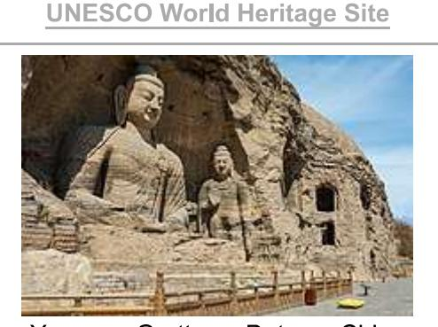
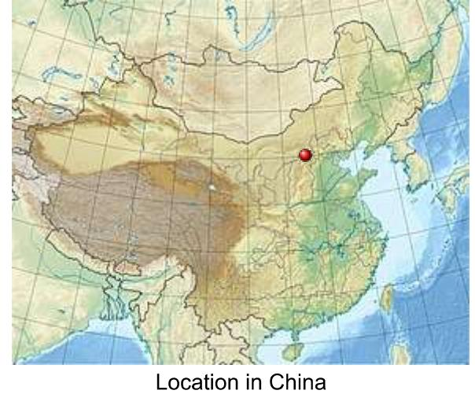
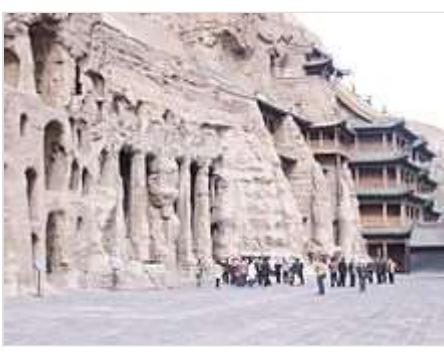
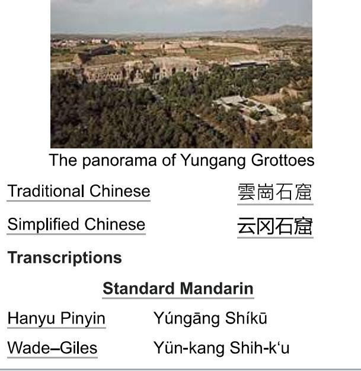
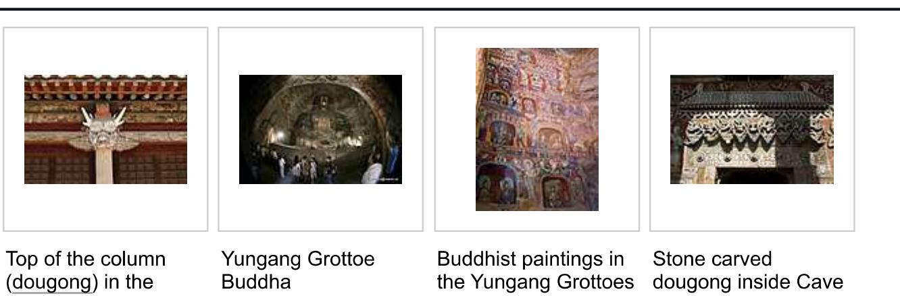
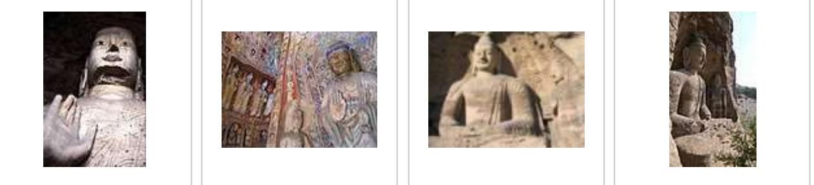
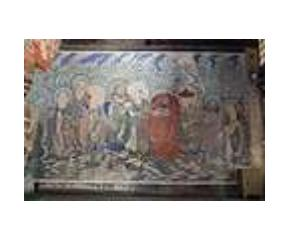
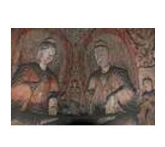
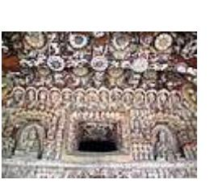
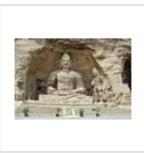

# Yungang Grottoes

The Yungang Grottoes (Chinese: 云冈石窟; pinyin: Yúngang shíkū), formerly the Wuzhoushan Grottoes (Chinese: 武 州 山 / 武 周 山 ; pinyin: Wu zhoushan), are ancient Chinese Buddhist temple grottoes built during the Northern Wei dynasty near the city of Datong, then called Pingcheng, in the province of Shanxi. They are excellent examples of rock-cut architecture and one of the three most famous ancient Buddhist sculptural sites of China. The others are Longmen and Mogao.

The site is located about 16 km west of the city of Datong, in the valley of the Shi Li river at the base of the Wuzhou Shan mountains. They are an outstanding example of the Chinese stone carvings from the 5th and 6th centuries. There are 5,3 major caves, along with 51,000 niches housing the same number of Buddha statues. Additionally, there are around 1,100 minor caves. A Ming dynasty-era fort is still located on top of the cliff housing the Yungang Grottoes.[1]

The grottoes were excavated in the south face of a sandstone cliff about 2600 feet long and 30 to 60 feet high. In 2001, the Yungang Grottoes were made a UNESCO World Heritage Site. The Yungang Grottoes are considered by UNESCO to be a "masterpiece of early Chinese Buddhist cave art ... [and] ... represent the successful fusion of Buddhist religious symbolic art from south and central Asia with Chinese cultural traditions, starting in the 5th century CE under Imperial auspices." It is classified as a AAAAA scenic area by the China National Tourism Administration.[3]

### History

After the decline of the Western Jin dynasty, the northern parts of China came under the control of the Tuoba-ruled Northern Wei. They made the city of

#### Yungang Grottoes

Yungang Grottoes, Datong, China

| Location              | Shanxi, China                                  |
|-----------------------|------------------------------------------------|
| Criteria              | Cultural: i, ii, iii, iv                       |
| Reference             | 1039 (https://whc.unesco.org/e n/list/1039) |
| Inscription           | 2001 (25th Session)                            |
| Area                  | 348.75 ha                                      |
| Buffer zone 846.81 ha |                                                |
|                       | Coordinates 40°06'38"N 113°07'33"F             |

#### Yungang Grottoes

Cave 9

Yungang Grottoes - Wikipedia

Pingcheng (平城), now known as Datong (大同), their capital. Due to its promotion, Pingcheng saw an increase in construction work. The Northern Wei early adopted Buddhism as their

state religion. Buddhism arrived in this location via travel on the ancient North Silk Road, the northernmost route of about 2600 kilometres in length, which connected the ancient Chinese capital of Xi'an to the

west over the Wushao Ling Pass to Wuwei and emerging in Kashgar before linking to ancient Parthia.[4]

The work on this first period of carving lasted until the year 465 AD, and these caves are now known as caves 16-20. Beginning around the year 471 AD, in a second construction phase that lasted until 494 AD, the twin caves 5/6, 7/8, and 9/10 as well as the caves 11, 12, and probably 13 were constructed under the supervision and support of the imperial patronage ended 494 AD with the move of the Wei court to the new capital of Luoyang. All other caves emerged under private patronage in a third construction period, lasting until 525, when the construction came to a final halt due to uprisings in the area.

#### Deterioration and Conservation

Since the end of the works, the sandstone of the grottoes has been exposed to heavy weathering. Many of the grottoes are exposed to the open air, and are therefore vulnerable to various forms of pollution and deterioration. Windblown dust and air pollution from the industrial city of Datong, as well as dust from mines and highways near the site pose a threat to the preservation of the ancient statues. The site is also in proximity of the Gobi Desert, the storms of which can contribute to the decay of the statues.15 The ensuing centuries therefore saw several attempts to preserve the caves and to repair sustained damage. During the Liao dynasty the caves saw some renewing of statues and, from 1049 to 1060, the buildup of the "10 temples of Yungang", which were meant to protect the main caves. However, they were destroyed again some 60 years later in a fire. The wooden buildings extant in front of caves 5 and 6 were constructed in 1621, during the early Qing dynasty. Since the 1950s, cracks in the sandstone have been sealed by grouting, and forestation has been implemented in an effort to reduce the weathering due to sandstorms. During the Cultural Revolution, Red Guards damaged many of the carvings, and bullet marks are still visible to observers. During April and May 1991,

Caltech personnel conducted air pollutant measurements in the Yungang Grottoes. It was found that nearly all of the airborne matter was mineral dust or carbon particles, allowing a focus of attention on sources of these kinds of matter.17

# Cave 6

Cave 6 is one of the richest of the Yungang sites. It was constructed between 465 and 494 C.E. by Emperor Xiao Wen. The cave's surface area is approximately 1,000 square meters. The entire interior of the cave is carved and painted. There is a stupa pillar in the center of the room extending from the floor to the ceiling. The walls are divided into two stories. The walls of the upper stories are host to carvings of standing Buddhas, Bodhisattvas, and monks among other celestial figures. All of the carvings were painted, but because the caves have been repainted evidently up to twelve times, determining the original scheme is difficult.[8]

# Gallery

One of the larger statues at Yungang

building protecting

Grottoes

the caves of Yungang

Statue at the Yungang Grottoes

9

Cave 12. Phase II, after 650 AD. Yungang Grottoes, Datong: a riot of decoration is illustrated here, with Buddhas, musicians, and apsarasas.

Cave 12. Phase II, after 465 AD. Yungang Grottoes, Datong: musicians playing the pipa and sheng overlook the passing scene.

Cave 20

### References

- 1. Agnew, Neville (1997-06-19). Conservation of Ancient Sites on the Silk Road: Proceedings of an International Conference on the Conservation of Grotto Sites (https://books.google.com/books?id= 3JNQAgAAQBAJ&q=yungang+grottoes&pg=PA348). Getty Publications. ISBN 9780892364169.
- 2. "Yungang Grottoes" (https://whc.unesco.org/en/list/1039). UNESCO. Retrieved 2007-09-06.
- 3. "AAAAA Scenic Areas" (https://web.archive.org/web/20140404043021/http://en.cnta.gov.cn/html/2 008-11/2008-11-16-10-27-72978.html). China National Tourism Administration. 16 November 2008. Archived from the original (http://en.cnta.gov.cn/html/2008-11-16-10-27-72978.htm l) on April 4, 2014. Retrieved 9 April 2011.
- 4. [1] (http://www.megalithic.co.uk/article.php?sid=18006) Silk Road, North Chinael Hogan, the Megalithic Portal, ed. A. Burnham, 2007]
- 5. Salmon, Lynn G .; Christoforou, Christos S .; Cass, Glen R. (1994). "Airborne Pollutants in the Buddhist Cave Temples at the Yungang Grottoes, China". Environmental Science & Technology. 28 (5): 805-811. Bibcode:1994EnST...28..805S (https://ui.adsabs.harvard.edu/abs/1994EnST...2 8..805S). doi:10.1021/es00054a010 (https://doi.org/10.1021%2Fes00054a010). PMID 22191820 (https://pubmed.ncbi.nlm.nih.gov/22191820).
- 6. report of the UNESCO advisory board (https://whc.unesco.org/archive/advisory body evaluation/ 1039.pdf)
- 7. Salmon, Lynn G .; Christoforou, Christos S .; Cass, Glen R. (1994). "Airborne Pollutants in the Buddhist Cave Temples at the Yungang Grottoes, China". Environmental Science & Technology.

28 (5): 805-811. Bibcode:1994EnST...28..805S (https://ui.adsabs.harvard.edu/abs/1994EnST...2 8..805S). doi:10.1021/es00054a010 (https://doi.org/10.1021%2Fes00054a010). PMID 22191820 (https://pubmed.ncbi.nlm.nih.gov/22191820).

8. Agnew, Neville (1997-06-19). Conservation of Ancient Sites on the Silk Road: Proceedings of an International Conference on the Conservation of Grotto Sites (https://books.google.com/books?id= 3JNQAgAAQBAJ&q=yungang+grottoes&pg=PA348). Getty Publications. ISBN 9780892364169.

## Further reading

- Caswell, James O. (1988). Written and Unwritten: A New History of the Buddhist Caves at Yungang. Vancouver: University of British Columbia Press. ISBN 9780774803007.
- Leidy, Denise Patry & Strahan, Donna (2010). Wisdom embodied: Chinese Buddhist and Daoist sculpture in the Metropolitan Museum of Art (http://libmma.contentdm.oclc.org/cdm/compoundobje ct/collection/p15324coll10/id/62659). New York: The Metropolitan Museum of Art. ISBN 9781588393999.
- "The Oldest Buddhist Stone Monuments known to China fifth-century sculptures at Wu Chou Shan", well-illustrated feature in The Illustrated London News, 10 October 1931.

### External links

- Official website (https://web.archive.org/web/20110526201023/http://www.yunqang.org/) (in Chinese)
- UNESCO World Heritage page about Yungang Grottoes (https://whc.unesco.org/en/list/1039)
- Protecting the Yungang Grottoes from Air Pollution Damage (http://www.thesalmons.org/lynn/chin awork.html)

Retrieved from "https://en.wikipedia.org/w/index.php?title=Yungang\_Grottoes&oldid=1217342415"